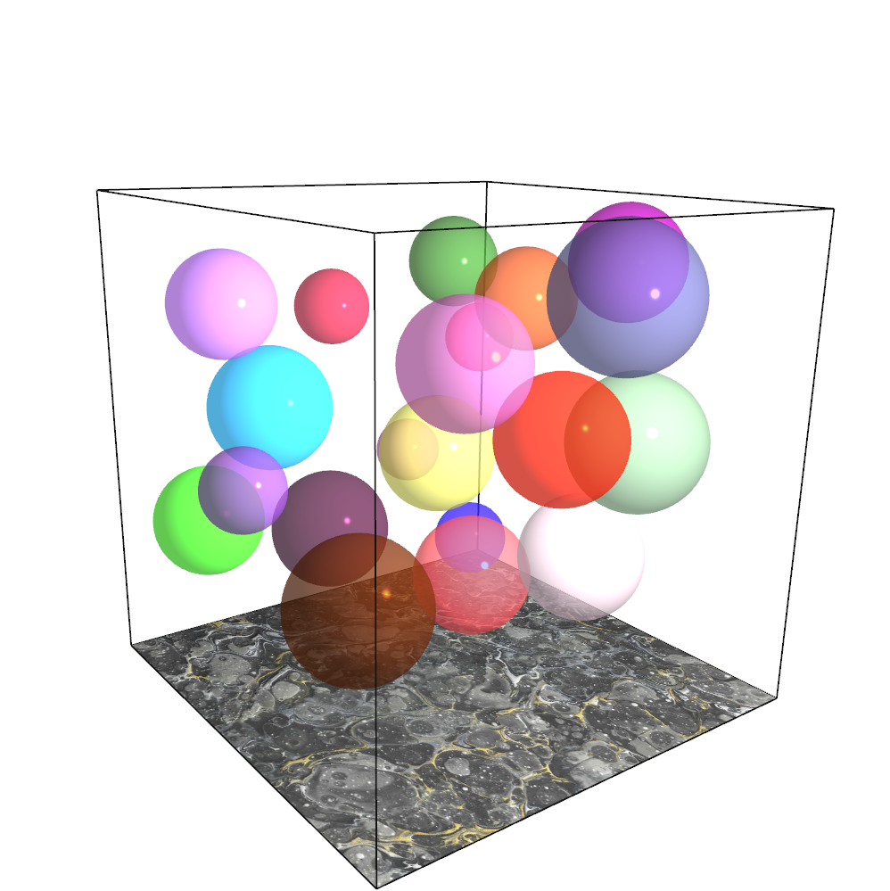

# BubblesGL
A serene scene inspired by the classic Bubbles screensaver.

The scene is implemented in both 2D and 3D, each in a seperate branch.
***
## Implementation
- Bubble:
    - [Parametric surface](https://en.wikipedia.org/wiki/Parametric_surface): Sphere

- Floor:
    - Texture + [Normal map](https://en.wikipedia.org/wiki/Normal_mapping)
    - Source: [Seamless Calgary Marble Countertop](http://www.texturise.club/2013/08/seamless-calgary-marble-countertop-maps.html)

- Camera: 
    - Arcball / Trackball
    - Rotation using [quaternions](https://en.wikipedia.org/wiki/Quaternion)

- Lighting:
    - [Phong lighting](https://en.wikipedia.org/wiki/Phong_reflection_model)

- IDE:
    - Visual Studio 2019

- Third-party libraries:
    - [freeGLUT](http://freeglut.sourceforge.net/)
    - [GLEW](http://glew.sourceforge.net/)
    - [OpenGL Mathematics (GLM)](https://github.com/g-truc/glm)
    - [stb_image from stb](https://github.com/nothings/stb) for texture loading

***

## Images
The 3D scene looks like this:  

The 2D scene looks like this:  
Note to self: don't forget to also add gif!

